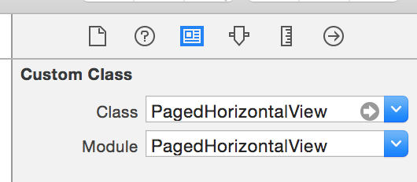
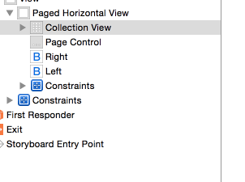

# PagedHorizontalView

[](https://travis-ci.org/mohamede1945/PagedHorizontalView)
[](http://cocoapods.org/pods/PagedHorizontalView)
[](http://cocoapods.org/pods/PagedHorizontalView)
[](http://cocoapods.org/pods/PagedHorizontalView)

A horizontal scoller view that makes its collection view cells full screen
and can optionally wire UIPageControl and a previous and next UIbuttons.

It doesn't affect the appearance of the controls and doesn't implement the collection view data source to keep full flexibility while doing the repeated work for a horizontal scroller.

## Requirements

- iOS 7.0+ / Mac OS X 10.9+
- Xcode 6.3

## Usage

###### Interface builder:

1. Drag and drop a `UIView`.
2. Change the class name to `PagedHorizontalView` from identity inspector.

3. Drag and drop a `UICollectionView`, use the defaults.
4. Optionally drag and drop a `UIPageControl`
5. Optionally drag and drop 2 `UIButtons` for next and previous
4. Wire the `UICollectionView` to the `PagedHorizontalView`

5. Wire the `UIPageControl` to the `PagedHorizontalView` either the reference outlet `pageControl` or the `pageChanged:` action. But not both.
6. Wire the 2 `UIButtons` either the reference outlet `nextButton` and `previousButton` or touch up inside action with `goToNextPage` and `goToPreviousPage`. But not both, wiring the action and the reference outlet will give unexpected behavior.

###### Programmatically:
Alternatively, you can create it from code just as you create a normal UIView
and set the properties instead of wiring them as described above for `collectionView`, `pageControl`, etc.

You need to set a layout object of kind `UICollectionViewFlowLayout` for the `UICollectionView`.

### IMPORTANT
In both cases programmatically or using interface builder, you should set the `dataSource` for the `UICollectionView` yourself. This way, you have full flexibility to specify the layout of the scrolling content.

## Demo


## Installation

**For iOS 8 or later:**

PagedHorizontalView is available through [CocoaPods](http://cocoapods.org). To install
it, simply add the following line to your Podfile:

```ruby
pod "PagedHorizontalView"
```

**For iOS 7.x:**

> Embedded frameworks require a minimum deployment target of iOS 8.

To use PagedHorizontalView with a project targeting iOS 7, you must include PagedHorizontalView.swift directly into your project.

## Author

Mohamed Afifi, mohamede1945

## License

PagedHorizontalView is available under the MIT license. See the LICENSE file for more info.
